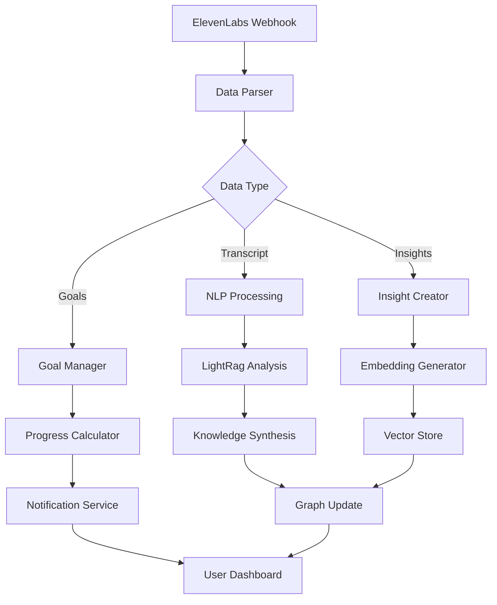

# ElevenLabs + LiveGuide Integration Architecture

## Executive Summary

This document outlines the comprehensive integration strategy between ElevenLabs conversational AI agents and LiveGuide's temporal knowledge graph system. The integration enables real-time bidirectional data flow during voice conversations, automatic goal tracking, and intelligent knowledge synthesis.

## Core Integration Components

### 1. MCP Server (Model Context Protocol)

The MCP server provides real-time data access to ElevenLabs agents during conversations.

#### Configuration
- **Server Type**: SSE (Server-Sent Events) or Streamable HTTP
- **Endpoint**: `https://[your-domain]/api/mcp-liveguide`
- **Authentication**: Bearer token with secret validation

#### Available Tools

```typescript
// Tool definitions for agent access
interface MCPTools {
  // Graph Context Tools
  getUserGraph(userId: string): GraphContext
  getActiveGoals(userId: string): Goal[]
  getRecentInsights(userId: string, days: number): Insight[]
  
  // Search Tools
  searchNodes(query: string, nodeType?: string): SearchResult[]
  findSimilarNodes(nodeId: string, limit: number): Node[]
  getTemporalContext(timeRange: DateRange): TemporalGraph
  
  // Creation Tools
  createNode(type: NodeType, label: string, description: string): Node
  createEdge(source: string, target: string, type: EdgeType): Edge
  updateGoalStatus(goalId: string, status: GoalStatus): Goal
  
  // Analysis Tools
  findRelatedInsights(nodeId: string): Insight[]
  calculateGoalProgress(goalId: string): ProgressMetrics
  extractKeyTopics(transcript: string): Topic[]
}
```

#### Implementation Path
1. Create Supabase Edge Function: `supabase/functions/mcp-server/`
2. Implement SSE streaming for real-time responses
3. Add rate limiting and caching
4. Deploy with authentication middleware

### 2. Webhook Integration

#### 2.1 Initiation Webhook (Pre-Call)
Provides context to the agent before conversation starts.

**Endpoint**: `https://[supabase-url]/functions/v1/elevenlabs-init-webhook`

**Request Payload**:
```json
{
  "conversationId": "uuid",
  "userId": "uuid",
  "agentId": "string",
  "metadata": {
    "sessionType": "goal_discovery",
    "phase": "onboarding"
  }
}
```

**Response Payload**:
```json
{
  "context": {
    "userName": "string",
    "activeGoals": ["goal1", "goal2"],
    "recentTopics": ["topic1", "topic2"],
    "coachingStyle": "supportive",
    "lastSessionSummary": "string",
    "graphStats": {
      "totalNodes": 150,
      "totalEdges": 280,
      "goalCompletionRate": 0.65
    }
  },
  "systemPromptOverride": "optional custom prompt",
  "additionalKnowledge": ["fact1", "fact2"]
}
```

#### 2.2 Post-Call Webhook
Processes conversation data after call completion.

**Endpoint**: `https://[supabase-url]/functions/v1/elevenlabs-post-webhook`

**Receives**:
```json
{
  "conversationId": "uuid",
  "transcript": "full conversation text",
  "duration": 1200,
  "analysis": {
    "User_Goals": ["goal1", "goal2"],
    "timescales": ["next week", "by Q2"],
    "concerns": ["time management", "motivation"],
    "action_items": ["item1", "item2"]
  },
  "evaluationResults": {
    "goalAchieved": true,
    "confidence": 0.85
  }
}
```

**Processing Steps**:
1. Parse transcript and extracted data
2. Create/update graph nodes for goals, insights, emotions
3. Generate embeddings for semantic search
4. Create temporal edges with timestamps
5. Update user progress metrics
6. Trigger N8N workflow for advanced processing

### 3. Agent Configuration

#### 3.1 System Prompt Enhancement
```text
You are Maya, LiveGuide's AI coach integrated with a knowledge graph system.

# Core Capabilities
- Access to user's personal knowledge graph via MCP tools
- Real-time goal tracking and progress monitoring
- Ability to create and link insights during conversation
- Temporal awareness of user's journey

# During Conversations
1. Query current goals using getUserGraph()
2. Create insight nodes for key realizations
3. Link emotions to specific topics
4. Track goal progress in real-time
5. Extract action items for follow-up

# Communication Style
- Reference past insights when relevant
- Connect current discussion to existing goals
- Highlight patterns across time
- Celebrate progress and achievements
```

#### 3.2 Analysis Configuration

**Evaluation Criteria**:
- Goal Achievement Detection
- Insight Quality Assessment
- Emotional State Tracking
- Action Item Extraction

**Data Collection Fields**:
```yaml
User_Goals:
  type: string
  description: "Goals mentioned or implied by user"
  
timescales:
  type: string
  description: "Time-related commitments or deadlines"
  
emotions:
  type: string
  description: "Emotional states expressed"
  
insights:
  type: string
  description: "Key realizations or breakthroughs"
  
action_items:
  type: string
  description: "Concrete next steps identified"
  
obstacles:
  type: string
  description: "Challenges or blockers mentioned"
```

### 4. N8N Workflow Architecture

#### Workflow Components



#### Key Nodes
1. **Webhook Receiver**: Validates and parses ElevenLabs data
2. **Data Transformer**: Formats data for Supabase operations
3. **Graph Operations**: Creates nodes and edges
4. **LightRag Integration**: Semantic analysis and synthesis
5. **Notification Handler**: Updates user on goal progress
6. **Error Handler**: Logs and retries failed operations

### 5. Data Flow Sequences

#### Conversation Initiation
```
User → LiveGuide → Init Webhook → ElevenLabs Agent
                        ↓
                  Graph Context
                        ↓
                  Agent Memory
```

#### During Conversation
```
Agent ↔ MCP Server ↔ Supabase ↔ Graph Database
   ↓        ↓           ↓            ↓
Tools   Real-time   Updates    Embeddings
```

#### Post-Conversation
```
ElevenLabs → Post Webhook → N8N Workflow
                 ↓              ↓
            Data Extract    LightRag
                 ↓              ↓
            Graph Update   Synthesis
                 ↓              ↓
            User Dashboard  Insights
```

### 6. Security Implementation

#### Authentication Flow
1. User authenticates with LiveGuide
2. LiveGuide generates session token
3. Token passed to ElevenLabs via metadata
4. MCP server validates token on each request
5. RLS policies enforce data isolation

#### Security Measures
- **Token Rotation**: 24-hour expiry with refresh
- **Rate Limiting**: 100 requests/minute per user
- **Webhook Signatures**: HMAC-SHA256 validation
- **Data Encryption**: AES-256 for sensitive fields
- **Audit Logging**: All operations logged with user context

### 7. Implementation Phases

#### Phase 1: Core Infrastructure (Week 1-2)
- [ ] Create MCP server with basic tools
- [ ] Implement webhook handlers
- [ ] Set up authentication flow
- [ ] Deploy to Supabase Edge Functions

#### Phase 2: Agent Configuration (Week 2-3)
- [ ] Configure ElevenLabs agent
- [ ] Set up knowledge base
- [ ] Define analysis criteria
- [ ] Test webhook integration

#### Phase 3: N8N Workflow (Week 3-4)
- [ ] Design workflow architecture
- [ ] Implement data transformations
- [ ] Integrate LightRag
- [ ] Add error handling

#### Phase 4: Testing & Optimization (Week 4-5)
- [ ] Unit tests for all components
- [ ] Integration testing
- [ ] Load testing
- [ ] Performance optimization

#### Phase 5: Production Deployment (Week 5-6)
- [ ] Deploy to production
- [ ] Monitor performance
- [ ] Gather user feedback
- [ ] Iterate on improvements

### 8. Testing Strategy

#### Unit Tests
- MCP server tool functions
- Webhook payload validation
- Data transformation logic
- Graph operation functions

#### Integration Tests
- End-to-end conversation flow
- MCP server response times
- Webhook delivery reliability
- N8N workflow execution

#### Load Tests
- Concurrent conversation handling
- MCP server under load
- Database query performance
- Embedding generation throughput

#### User Acceptance Tests
- Goal tracking accuracy
- Insight quality
- Response latency
- User experience feedback

### 9. Monitoring & Analytics

#### Key Metrics
- **Conversation Metrics**:
  - Average duration
  - Goals identified per session
  - Insights generated
  - User satisfaction scores

- **Technical Metrics**:
  - MCP server response time
  - Webhook success rate
  - Embedding generation time
  - Database query performance

- **Business Metrics**:
  - Goal completion rate
  - User engagement
  - Knowledge graph growth
  - Retention rates

#### Monitoring Tools
- Supabase Dashboard for database metrics
- N8N execution logs
- ElevenLabs conversation analytics
- Custom LiveGuide dashboard

### 10. Future Enhancements

#### Short-term (3 months)
- Multi-language support
- Advanced goal templates
- Emotion-based coaching adaptation
- Group coaching sessions

#### Medium-term (6 months)
- Predictive goal suggestions
- Cross-user insight patterns
- AI-powered coaching strategies
- Integration with calendar systems

#### Long-term (12 months)
- Virtual reality coaching sessions
- Biometric integration
- Advanced behavioral analytics
- Autonomous coaching agents

## Conclusion

This integration creates a powerful synergy between conversational AI and knowledge graphs, enabling:
- Real-time, context-aware coaching
- Automatic knowledge capture and organization
- Data-driven goal tracking
- Personalized growth insights

The architecture is designed to be scalable, secure, and maintainable while providing a seamless user experience.