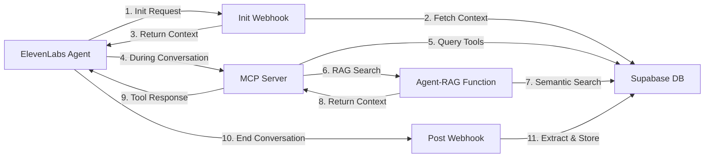

# ElevenLabs MCP Server with RAG Context Integration Guide

## Overview

This guide explains how to configure ElevenLabs agents to receive user context from the LiveGuide knowledge graph through the MCP (Model Context Protocol) server with RAG (Retrieval Augmented Generation) enrichment.

## Architecture



## Current Setup

### 1. MCP Server URL
```
https://hlwxmfwrksflvcacjafg.supabase.co/functions/v1/mcp-server
```

### 2. N8N Webhook
```
https://n8n-hatchdev.fly.dev/webhook/c389dc70-b6c9-4cd7-9520-bebe372c800a
```

### 3. Agent-RAG Function
```
https://hlwxmfwrksflvcacjafg.supabase.co/functions/v1/agent-rag
```

## Integration Configuration

### Step 1: Configure ElevenLabs Agent Dashboard

#### A. Widget Tab - Webhook URLs
```json
{
  "initiation_webhook": "https://hlwxmfwrksflvcacjafg.supabase.co/functions/v1/elevenlabs-init-webhook",
  "completion_webhook": "https://hlwxmfwrksflvcacjafg.supabase.co/functions/v1/elevenlabs-webhook"
}
```

#### B. Integration Tab - MCP Server
```json
{
  "mcp_server_url": "https://hlwxmfwrksflvcacjafg.supabase.co/functions/v1/mcp-server",
  "protocol_version": "2024-11-05",
  "transport": "http"
}
```

#### C. Analysis Tab - Data Collection Fields
```json
{
  "User_Goals": {
    "type": "array",
    "description": "Extract specific goals mentioned by the user",
    "items": {
      "type": "object",
      "properties": {
        "original_text": {"type": "string"},
        "goal_category": {"type": "string"},
        "timeline": {"type": "string"},
        "confidence_level": {"type": "number"}
      }
    }
  },
  "User_Name": {"type": "string"},
  "Learning_Style": {"type": "string"},
  "Time_Commitment": {"type": "string"}
}
```

### Step 2: Update Agent System Prompt

Add this to your agent's system prompt to enable RAG context usage:

```
You are an AI coach with access to the user's knowledge graph through MCP tools. 

## Available Context Tools

1. **get_user_graph** - Retrieve complete knowledge graph
2. **search_nodes** - Semantic search for relevant insights
3. **create_node** - Add new goals or insights
4. **get_recent_nodes** - Get recent activity
5. **get_onboarding_state** - Check onboarding progress

## Context Integration

When starting a conversation:
- The initiation webhook provides initial user context
- Use MCP tools to query deeper context as needed
- Search for relevant past insights before providing advice

Example tool usage:
- To find related goals: search_nodes(query="fitness goals", nodeType="goal")
- To check progress: get_recent_nodes(nodeType="accomplishment", limit=5)
- To add new insight: create_node(type="insight", label="User discovered...", description="...")

## RAG-Enhanced Responses

Before answering questions:
1. Search the knowledge graph for relevant context
2. Consider user's past goals and insights
3. Reference specific past conversations when relevant
4. Build on existing knowledge rather than starting fresh

Remember: You have access to the user's complete journey. Use it to provide personalized, contextual coaching.
```

### Step 3: MCP Server Tool Integration

The MCP server exposes these RAG-enhanced tools:

```typescript
// Core Knowledge Graph Tools
{
  name: "get_user_graph",
  description: "Retrieve the user's complete knowledge graph",
  parameters: {
    userId: "string"
  }
}

{
  name: "search_nodes",
  description: "Semantic search for relevant nodes",
  parameters: {
    query: "string",
    userId: "string",
    nodeType?: "goal|skill|emotion|session|accomplishment",
    limit?: "number"
  }
}

// Onboarding Tools
{
  name: "get_onboarding_state",
  description: "Get current onboarding progress",
  parameters: {
    userId: "string"
  }
}

{
  name: "get_conversation_context",
  description: "Get conversation history and context",
  parameters: {
    userId: "string",
    conversationId?: "string"
  }
}
```

### Step 4: RAG Context Flow

#### Pre-Conversation (Init Webhook)
1. ElevenLabs sends conversation init request
2. Webhook fetches user profile and recent goals
3. Returns personalized greeting and context

```typescript
// Init webhook response
{
  user_context: {
    user_name: "John",
    has_existing_goals: true,
    recent_goals: ["Learn Spanish", "Run 5K"],
    onboarding_completed: true,
    preferred_categories: ["health", "learning"],
    learning_style: "visual"
  },
  instructions: "User has completed onboarding. Focus on existing goals...",
  first_message_override: "Hi John! Welcome back..."
}
```

#### During Conversation (MCP Tools)
Agent can query context in real-time:

```javascript
// Example: Agent searches for fitness-related insights
const insights = await tools.call("search_nodes", {
  userId: "907f679d-b36a-42a8-8b60-ce0d9cc11726",
  query: "fitness exercise routine",
  nodeType: "insight",
  limit: 5
});
```

#### RAG Enhancement via Agent-RAG Function
The MCP server internally calls the agent-rag function for enhanced context:

```typescript
// Internal RAG call from MCP server
const ragContext = await fetch(`${BASE_URL}/functions/v1/agent-rag`, {
  method: 'POST',
  body: JSON.stringify({
    userId: params.userId,
    query: params.query,
    maxTokens: 12000,
    includeKnowledgeBase: true,
    includeSimilarPatterns: true
  })
});

// Returns enriched context with:
// - Relevant goals and insights
// - Knowledge base chunks
// - Similar user patterns
// - Semantic search results
```

### Step 5: Testing the Integration

#### A. Test MCP Server Connection
```bash
curl -X POST https://hlwxmfwrksflvcacjafg.supabase.co/functions/v1/mcp-server \
  -H "Content-Type: application/json" \
  -d '{
    "jsonrpc": "2.0",
    "id": 1,
    "method": "tools/list",
    "params": {}
  }'
```

#### B. Test Tool Execution
```bash
curl -X POST https://hlwxmfwrksflvcacjafg.supabase.co/functions/v1/mcp-server \
  -H "Content-Type: application/json" \
  -d '{
    "jsonrpc": "2.0",
    "id": 2,
    "method": "tools/call",
    "params": {
      "name": "search_nodes",
      "arguments": {
        "userId": "907f679d-b36a-42a8-8b60-ce0d9cc11726",
        "query": "fitness goals",
        "nodeType": "goal",
        "limit": 5
      }
    }
  }'
```

#### C. Test RAG Context
```bash
curl -X POST https://hlwxmfwrksflvcacjafg.supabase.co/functions/v1/agent-rag \
  -H "Content-Type: application/json" \
  -d '{
    "userId": "907f679d-b36a-42a8-8b60-ce0d9cc11726",
    "query": "what are my fitness goals",
    "maxTokens": 5000
  }'
```

## Troubleshooting

### Issue: Agent not receiving context
1. Check webhook URLs are configured correctly in ElevenLabs dashboard
2. Verify webhook secret matches environment variable
3. Check Supabase function logs: `supabase functions logs elevenlabs-init-webhook`

### Issue: MCP tools not working
1. Verify MCP server URL in Integration tab
2. Check tool names match exactly (case-sensitive)
3. Ensure userId is passed in tool arguments
4. Review MCP server logs: `supabase functions logs mcp-server`

### Issue: RAG context not enriched
1. Check OpenAI API key is configured
2. Verify embeddings are generated for nodes
3. Check agent-rag function logs: `supabase functions logs agent-rag`
4. Ensure semantic search RPC functions exist in database

### Issue: Authentication errors
1. MCP server currently has public access (no auth required)
2. Webhooks validate using X-Webhook-Secret header
3. Ensure SUPABASE_SERVICE_ROLE_KEY is set for database access

## Best Practices

### 1. Context Window Management
- Limit RAG context to 12,000 tokens (default)
- Prioritize recent and relevant information
- Use semantic similarity thresholds (0.6+ for relevance)

### 2. Tool Usage Patterns
- Cache user graph at conversation start
- Use semantic search for specific queries
- Create nodes for significant insights only
- Batch related tool calls when possible

### 3. Privacy & Security
- User data stays within Supabase RLS boundaries
- MCP server uses service role for cross-user patterns
- Webhook secrets prevent unauthorized access
- No PII in logs or error messages

### 4. Performance Optimization
- Pre-fetch context in init webhook
- Use connection pooling in MCP server
- Cache embeddings for repeated queries
- Implement request debouncing for tools

## Integration Checklist

- [ ] Configure webhook URLs in ElevenLabs Widget tab
- [ ] Add MCP server URL in Integration tab
- [ ] Setup Analysis tab data collection fields
- [ ] Update agent system prompt with context instructions
- [ ] Deploy all Supabase functions
- [ ] Test webhook endpoints
- [ ] Test MCP tool execution
- [ ] Verify RAG context enrichment
- [ ] Monitor function logs during test conversations
- [ ] Document agent-specific configurations

## Next Steps

1. **Enhanced RAG Context**: Implement caching layer for frequently accessed context
2. **Tool Optimization**: Add batching for multiple tool calls
3. **Context Summarization**: Use LLM to summarize large contexts
4. **Feedback Loop**: Store tool usage analytics for optimization
5. **Multi-Agent Support**: Configure different contexts per agent persona

## Support

For issues or questions:
- Check Supabase function logs
- Review ElevenLabs agent conversation logs
- Test individual components with curl commands
- Contact support with conversation IDs for debugging