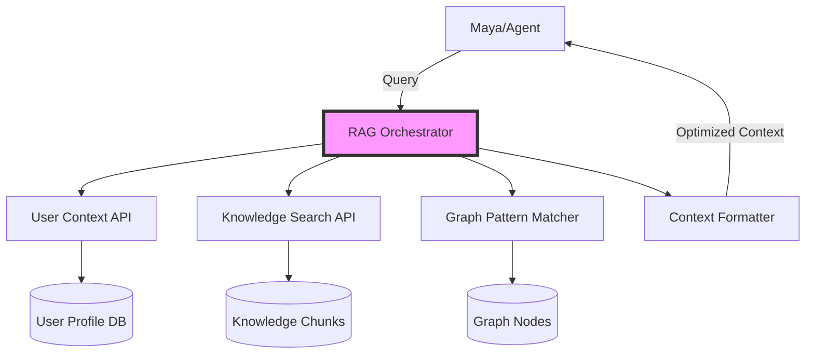

# Maya RAG Integration Strategy for LiveGuide

## Executive Summary

This document outlines how to integrate LiveGuide's existing knowledge graph and embedding systems with Maya and other ElevenLabs conversational agents to create a powerful RAG (Retrieval-Augmented Generation) system.

## Current System Architecture

### LiveGuide's Existing RAG Infrastructure

1. **Vector Storage**: PostgreSQL with pgvector extension (1536-dimensional OpenAI embeddings)
2. **Knowledge Sources**:
   - Graph nodes with embeddings (`graph_nodes` table)
   - Knowledge documents and chunks (`knowledge_documents`, `knowledge_chunks`)
   - User goals, insights, and emotional states
3. **Search Capabilities**:
   - Semantic search via cosine similarity
   - Hybrid search (semantic + keyword)
   - Real-time graph updates via Supabase subscriptions

### ElevenLabs RAG Requirements

Based on their documentation, ElevenLabs agents expect:
- **Embedding Model**: e5-mistral-7b-instruct (or custom)
- **Max Retrieved Content**: 50,000 characters
- **Content Sources**: FAQ databases, documentation files

## Integration Strategy

### Phase 1: Dynamic Knowledge Base Construction

Instead of static RAG documents, create a **dynamic knowledge retrieval system** that Maya can access in real-time:

```typescript
// Real-time RAG API endpoint for Maya
interface MayaRAGContext {
  userHistory: {
    goals: Goal[];
    insights: Insight[];
    recentInteractions: AgentInteraction[];
    currentProgress: OnboardingProgress;
  };
  relevantKnowledge: {
    similarGoals: GraphNode[];      // From other users (anonymized)
    relatedInsights: GraphNode[];    // Semantic matches
    agentExpertise: AgentProfile[];  // Available specialists
  };
  contextualGuidance: {
    nextSteps: string[];
    suggestedQuestions: string[];
    potentialObstacles: string[];
  };
}
```

### Phase 2: Three-Tier RAG Architecture

#### Tier 1: Static Core Knowledge (In System Prompt)
- Operational guardrails
- Agent personalities and expertise
- Platform capabilities
- Conversation protocols

#### Tier 2: User-Specific Dynamic Context (Via MCP Server)
```javascript
// MCP tool for real-time context retrieval
async function getUserRAGContext(userId, query) {
  // 1. Fetch user's graph data
  const userGraph = await fetchUserGraph(userId);
  
  // 2. Semantic search across knowledge base
  const embedding = await generateEmbedding(query);
  const relevantChunks = await searchKnowledgeChunks(embedding);
  
  // 3. Find similar patterns from other users
  const patterns = await findSimilarUserJourneys(userGraph);
  
  // 4. Format for Maya's consumption (max 50k chars)
  return formatRAGContext({
    userGraph,
    relevantChunks,
    patterns,
    maxLength: 50000
  });
}
```

#### Tier 3: Session-Specific Working Memory
- Current conversation goals
- Identified obstacles
- Agent recommendations pending
- UI state and user preferences

### Phase 3: Implementation Architecture



### Phase 4: ElevenLabs Configuration

#### 4.1 Custom Knowledge Base Setup

Instead of static documents, configure ElevenLabs to use our dynamic API:

```javascript
// ElevenLabs Agent Configuration
{
  "knowledgeBase": {
    "type": "dynamic",
    "endpoint": "https://your-domain.com/api/agent-rag",
    "authentication": "bearer",
    "refreshInterval": "per-conversation",
    "maxContextSize": 50000
  }
}
```

#### 4.2 MCP Server Integration

Create MCP tools that Maya can call during conversations:

```typescript
// MCP Tools for Maya
const mcpTools = {
  searchUserGoals: async (query: string) => {
    // Search user's goals with semantic matching
  },
  
  findSimilarJourneys: async (goalType: string) => {
    // Find anonymized patterns from similar users
  },
  
  getAgentExpertise: async (domain: string) => {
    // Retrieve specialist agent profiles
  },
  
  retrieveInsights: async (topic: string) => {
    // Get relevant insights from knowledge graph
  }
};
```

### Phase 5: Dynamic Context Injection

#### 5.1 Pre-Conversation Context (Webhook)

```javascript
// elevenlabs-init-webhook
app.post('/api/elevenlabs-init', async (req, res) => {
  const { userId, conversationId } = req.body;
  
  // Build initial RAG context
  const context = await buildInitialRAGContext(userId);
  
  res.json({
    customVariables: {
      userState: context.userState,
      recentGoals: context.goals.slice(0, 3),
      lastInsight: context.lastInsight,
      suggestedFocus: context.suggestedFocus
    },
    knowledgeContext: context.formattedKnowledge // Up to 50k chars
  });
});
```

#### 5.2 Mid-Conversation Updates (SSE/WebSocket)

```javascript
// Real-time context updates during conversation
class ConversationContextManager {
  async updateContext(conversationId: string, newInfo: any) {
    // 1. Update working memory
    this.workingMemory.set(conversationId, newInfo);
    
    // 2. Trigger re-indexing if needed
    if (this.shouldReindex(newInfo)) {
      await this.reindexKnowledge(conversationId);
    }
    
    // 3. Push update to agent
    await this.pushContextUpdate(conversationId);
  }
}
```

### Phase 6: Optimization Strategies

#### 6.1 Embedding Alignment

Since LiveGuide uses OpenAI embeddings and ElevenLabs prefers e5-mistral:

```python
# Dual embedding strategy
class HybridEmbeddingManager:
    def generate_embeddings(self, text):
        # Generate both for compatibility
        openai_embedding = self.openai_embed(text)  # For existing system
        e5_embedding = self.e5_embed(text)          # For ElevenLabs
        
        return {
            'openai': openai_embedding,
            'e5': e5_embedding,
            'text': text
        }
```

#### 6.2 Context Prioritization

```typescript
// Intelligent context selection
function prioritizeRAGContent(
  availableContent: Content[],
  query: string,
  maxChars: number = 50000
): string {
  // 1. Score by relevance
  const scored = availableContent.map(c => ({
    ...c,
    score: calculateRelevance(c, query)
  }));
  
  // 2. Sort by priority
  scored.sort((a, b) => {
    // User's own data first
    if (a.isUserData !== b.isUserData) 
      return a.isUserData ? -1 : 1;
    // Then by relevance score
    return b.score - a.score;
  });
  
  // 3. Fit within character limit
  return fitToLimit(scored, maxChars);
}
```

### Phase 7: Integration with Agent Ecosystem

#### 7.1 Shared Knowledge Protocol

All agents access the same knowledge base but with different lenses:

```typescript
interface AgentRAGLens {
  agentId: string;
  focusAreas: string[];       // Agent's expertise domains
  filterCriteria: {
    nodeTypes: NodeType[];     // Relevant node types
    emotionalStates?: string[]; // For empathy-focused agents
    goalCategories?: string[];  // For goal-oriented agents
  };
  contextFormatter: (data: any) => string; // Agent-specific formatting
}
```

#### 7.2 Cross-Agent Memory

```sql
-- Shared insights table for cross-agent learning
CREATE TABLE shared_agent_insights (
  id UUID PRIMARY KEY,
  source_agent_id UUID REFERENCES agent_personae(uuid),
  user_id UUID REFERENCES profiles(id),
  insight_type TEXT,
  content TEXT,
  embedding vector(1536),
  confidence_score FLOAT,
  used_by_agents UUID[], -- Track which agents used this
  created_at TIMESTAMPTZ DEFAULT NOW()
);
```

## Implementation Checklist

### Immediate Actions
- [ ] Create `/api/agent-rag` endpoint for dynamic context retrieval
- [ ] Implement context formatter to fit 50k character limit
- [ ] Set up MCP server with RAG tools
- [ ] Configure ElevenLabs webhooks for context injection

### Short-term (Week 1)
- [ ] Build user journey pattern matcher
- [ ] Implement semantic search across all knowledge sources
- [ ] Create agent-specific context lenses
- [ ] Set up real-time context updates via SSE

### Medium-term (Week 2-3)
- [ ] Implement dual embedding strategy (OpenAI + e5)
- [ ] Build conversation memory manager
- [ ] Create cross-agent insight sharing system
- [ ] Optimize retrieval performance

### Long-term (Month 1)
- [ ] Machine learning for context prioritization
- [ ] A/B testing different RAG strategies
- [ ] Implement feedback loop for RAG improvement
- [ ] Scale to handle concurrent conversations

## Performance Metrics

### Target Specifications
- **Context Retrieval**: < 200ms
- **Embedding Generation**: < 100ms
- **Total RAG Latency**: < 500ms
- **Context Relevance**: > 85% accuracy
- **Character Efficiency**: Use 80% of 50k limit effectively

### Monitoring Points
1. RAG query response times
2. Context relevance scores
3. Agent response quality with/without RAG
4. User goal achievement rates
5. Conversation completion rates

## Security Considerations

### Data Protection
- Anonymize other users' data in patterns
- Implement rate limiting on RAG queries
- Audit log all knowledge access
- Encrypt embeddings at rest

### Access Control
```typescript
// Role-based RAG access
const ragAccessControl = {
  maya: ['all'],  // Chief Onboarding Officer sees all
  specialist: ['domain_specific'], // Limited to expertise
  anonymous: ['public_only']  // Non-authenticated users
};
```

## Conclusion

This integration strategy transforms Maya from a scripted agent into an intelligent orchestrator with real-time access to:
1. User's complete goal and insight history
2. Patterns from similar user journeys
3. Collective knowledge from all conversations
4. Dynamic context that evolves during conversation

The key innovation is moving from static RAG documents to a **living knowledge system** that grows smarter with every interaction.